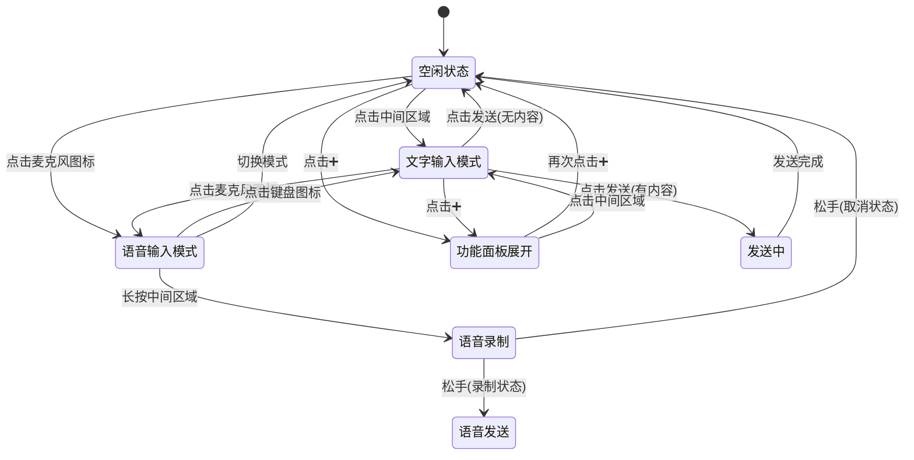
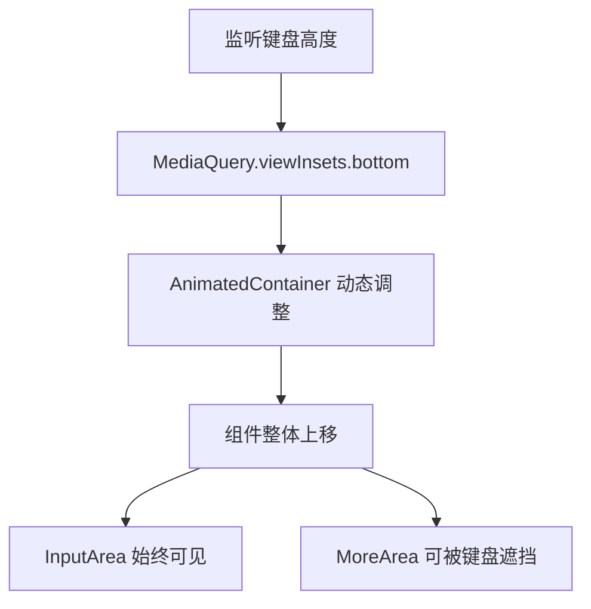

# Flutter Chat Composer 产品设计文档

## 产品概述

### 组件定位
- **多模态输入组件**：支持文字、语音、图片、文件等多种输入方式
- **聊天场景专用**：专为聊天应用设计的输入组件
- **功能完整**：包含完整的输入状态管理和错误处理

### 核心特性
- **智能适应**：文字输入框支持自适应高度调节（2-6行）
- **分层布局**：采用上下分层结构，输入区域和工具栏分离
- **流畅交互**：简化的模式切换，智能的状态恢复机制
- **主题定制**：支持 flat、clean、custom 主题和完全自定义
- **独立键盘适配**：无需依赖 `Scaffold.resizeToAvoidBottomInset`，即可实现系统键盘与自定义功能面板的无缝切换

## 界面布局设计

### 默认状态（空闲模式）
```plaintext
+---------------------------------------+
| 🎤 | 发消息或按住说话             | 📷 ➕ |
+---------------------------------------+
```

### 文字输入模式
```plaintext
+---------------------------------------+
| 文本输入区域（2-6行自适应）          |
| 用户输入内容...                      |
+---------------------------------------+
|                           | ➕ | 📤 |
+---------------------------------------+
```

### 语音输入模式
```plaintext
+---------------------------------------+
| ⌨️ | 按住 说话                   | 📷 ➕ |
+---------------------------------------+
```

### 更多功能面板
```plaintext
+---------------------------------------+
| 文本输入区域或提示文字               |
+---------------------------------------+
| SizedBox(height: 16.0)               |
+---------------------------------------+
| [相册] [文件] [扫描] [通话] [更多]   |
+---------------------------------------+
```

### 语音录制界面（覆盖层）
```plaintext
+---------------------------------------+
| 📍 松手发送，滑动取消                |
+---------------------------------------+
| 主题色背景 (录制状态)                |
| 红色背景 (取消状态)                  |
|                                      |
|    ● ● ● ● ● ● ● ●             |
|    (8个白色波点动画)                 |
+---------------------------------------+
```

## 核心交互设计

### 1. 交互方式总览

#### 模式切换
- **点击中间文字区域** → 进入文字输入模式
- **点击麦克风图标** → 在语音模式和其他模式间切换
- **点击键盘图标** → 从语音模式切换到文字模式
- **点击📷按钮** → 调用相机功能（弹出选择对话框）
- **点击➕按钮** → 展开/收起功能面板

#### 文字输入模式
- **自适应高度**：2-6行自动调整
- **工具栏分离**：下方独立工具栏，包含更多按钮和发送按钮
- **发送逻辑**：有内容时可发送，无内容时退出文字模式

#### 语音录制模式
- **长按录制**：长按中间区域开始录制
- **手势识别**：垂直滑动切换录制/取消状态  
- **覆盖层显示**：录制时显示全屏覆盖层
- **波点动画**：8个白色波点的连续动画效果

#### 更多功能面板
- **响应式高度**：基于屏幕宽度和内容计算的动态高度
- **水平布局**：5个功能按钮水平排列
- **键盘交互**：在文字模式下展开时，键盘收起但保持面板显示

### 2. 状态流转



### 3. 键盘适配机制

组件实现了独立的键盘适配，无需依赖 `Scaffold.resizeToAvoidBottomInset`：



### 4. "统一的底部动画容器"交互解析

为了实现键盘和功能面板之间流畅、无缝的切换，组件内部采用了一套精巧的"统一的底部动画容器"方案：

- **一个"魔法电梯"**：组件底部有一个看不见的"电梯"（`AnimatedContainer`），它的核心职责就是通过改变自身高度，将上方的输入区域（`InputArea`）向上顶起。
- **两种"乘客"**：
  1.  **系统键盘**：当用户点击输入框时，系统键盘就是乘客。"魔法电梯"会以极快的速度（与系统动画同步）升起，高度与键盘完全一致，将输入框精准地顶到键盘上方。
  2.  **功能面板 (`MoreArea`)**：当用户点击 `+` 按钮时，功能面板就是乘客。"魔法电梯"会以一个平滑的动画升起，将功能面板从底部优雅地"托举"上来。
- **无缝交接**：当用户从文字输入模式（键盘已弹出）点击 `+` 按钮时，方案能确保"系统键盘"这位乘客优雅地退场，同时"功能面板"乘客无缝地登场，避免了视觉上的抖动和卡顿，保证了极致流畅的交互体验。

这个统一的方案，使得无论是应对系统键盘还是内部自定义的功能面板，组件都能提供一致、稳定且符合物理直觉的动画效果。

## 功能特性

### 键盘适配优势
- **独立适配**：不依赖父级 Scaffold 配置
- **精确控制**：通过 AnimatedContainer 实现平滑过渡
- **布局保持**：MoreArea 相对位置保持不变

### 自适应布局
- **响应式宽度**：MoreArea 根据屏幕宽度自动计算布局
- **动态高度**：基于内容和屏幕宽度计算的精确高度控制
- **项目间距**：统一的 16px 间距设计

### 语音录制特性
- **覆盖层设计**：录制时全屏覆盖，视觉反馈明确
- **手势识别**：支持垂直滑动切换录制/取消状态
- **动画效果**：8个白色波点的相位动画
- **状态反馈**：背景色变化 + 触觉反馈

### 状态管理
- **控制器模式**：集中的状态管理
- **外部控制**：支持注入自定义控制器
- **状态同步**：通过 ChangeNotifier 实现

## 主题与定制

### 主题支持
- **Flat 主题**：科技蓝边框风格，适合现代应用（`ChatThemeStyle.flat`）
- **Clean 主题**：90%黑色无边框阴影风格，简洁大方（`ChatThemeStyle.clean`）
- **Custom 主题**：完全自定义的颜色和样式（`ChatThemeStyle.custom`）

### 主题配置方式

#### 1. 预设主题风格
```dart
ChatComposer(
  themeStyle: ChatThemeStyle.flat, // 或 ChatThemeStyle.clean
  onSubmit: (content) {},
)
```

#### 2. 完全自定义主题
```dart
ChatComposer(
  themeStyle: ChatThemeStyle.custom, // 必须设置为 custom
  theme: ChatComposerTheme.custom(
    primaryColor: Colors.deepPurple,
    backgroundColor: Colors.grey[100]!,
    surfaceColor: Colors.white,
    hasBorder: true,
    hasShadow: true,
    borderRadius: 12.0,
  ),
  onSubmit: (content) {},
)
```

#### 3. 基于Material主题
```dart
ChatComposer(
  theme: ChatComposerTheme.fromMaterial(Theme.of(context)),
  onSubmit: (content) {},
)
```

### 主题配置项
- **颜色系统**：primary、surface、background 等完整配色
- **尺寸系统**：统一的尺寸规范和间距
- **样式系统**：文字样式、动画时长等
- **装饰系统**：边框、阴影、圆角等视觉效果

## 错误处理与权限

### 错误处理机制
- **分类处理**：网络、权限、录制、文件等不同错误类型
- **用户友好**：Toast 提示 + Dialog 确认的组合方式
- **重试机制**：针对不同错误提供相应的重试选项

### 权限管理
- **麦克风权限**：录制前自动检查和请求
- **相机权限**：拍照前权限验证
- **文件权限**：文件选择时的权限处理

## 配置系统

### ChatComposerConfig 配置选项
```dart
ChatComposerConfig(
  enableVoice: true,          // 启用语音输入
  enableCamera: true,         // 启用相机功能
  enableMoreButton: true,     // 启用更多功能按钮
  enableHapticFeedback: true, // 启用触觉反馈
  maxTextLength: 1000,        // 最大文本长度
  minTextLines: 2,            // 文本输入框最小行数
  maxTextLines: 6,            // 文本输入框最大行数
  maxVoiceDuration: 60,       // 最大语音录制时长（秒）
)
```

## 无障碍与国际化

### 无障碍支持
- **语义化标签**：所有交互元素提供语义化标签
- **触觉反馈**：状态变化时的触觉反馈
- **屏幕阅读器**：完整的屏幕阅读器支持

### 文字配置
- **可配置文案**：placeholder、提示文字等可自定义
- **硬编码中文**：当前主要支持中文，可扩展多语言

## 性能优化

### 渲染优化
- **RepaintBoundary**：动画区域的重绘边界隔离
- **AnimatedBuilder**：精确的动画重建控制
- **setState 优化**：最小化状态更新范围

### 内存管理
- **控制器生命周期**：完整的 dispose 机制
- **监听器清理**：及时移除各种监听器
- **动画控制器**：统一的动画控制器管理

## 总结

Flutter Chat Composer 组件提供了完整的多模态输入解决方案：

### 核心优势
- **交互直观**：符合现代聊天应用的交互习惯
- **布局智能**：独立的键盘适配和响应式布局
- **功能完整**：支持文字、语音、图片、文件等多种输入
- **高度定制**：丰富的主题系统和配置选项

### 技术特点
- **架构清晰**：分层设计，职责明确
- **状态管理**：集中的控制器模式
- **错误处理**：完善的错误分类和处理机制
- **性能优化**：针对性的渲染和内存优化

### 使用场景
- 即时通讯应用
- 客服聊天系统
- 社交应用评论区
- 任何需要富文本输入的场景 